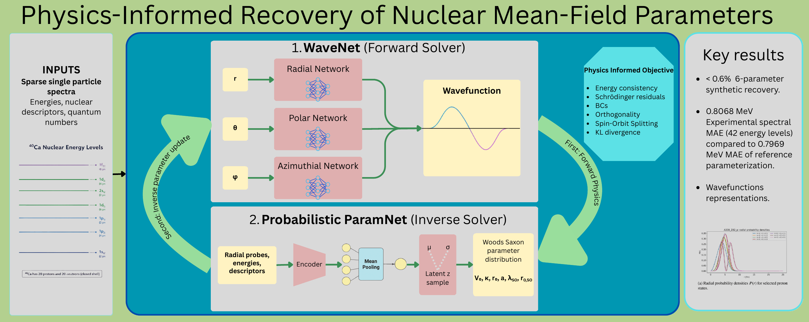
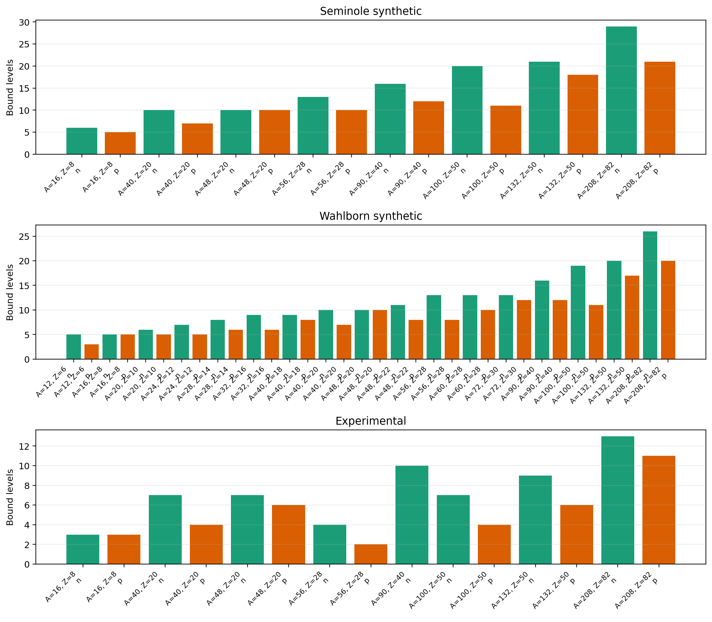
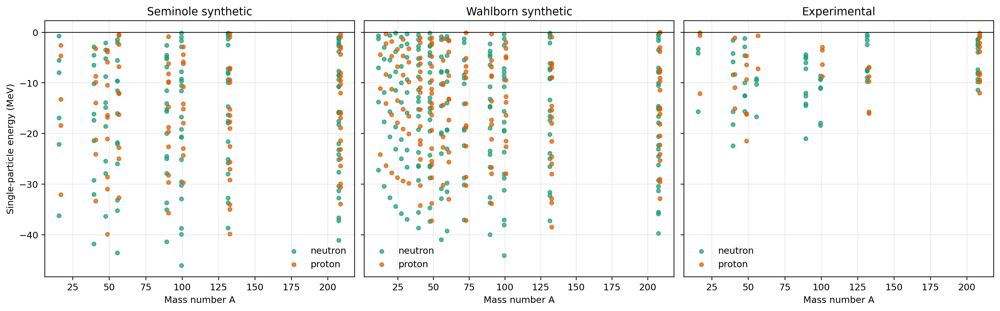
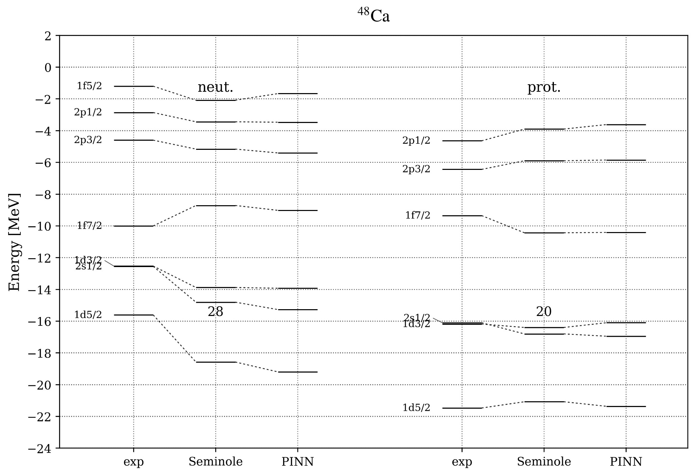
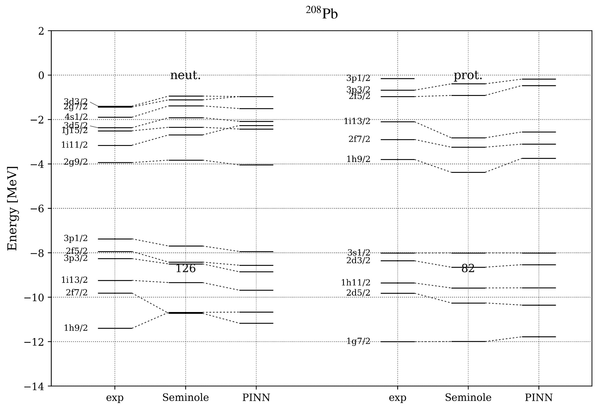
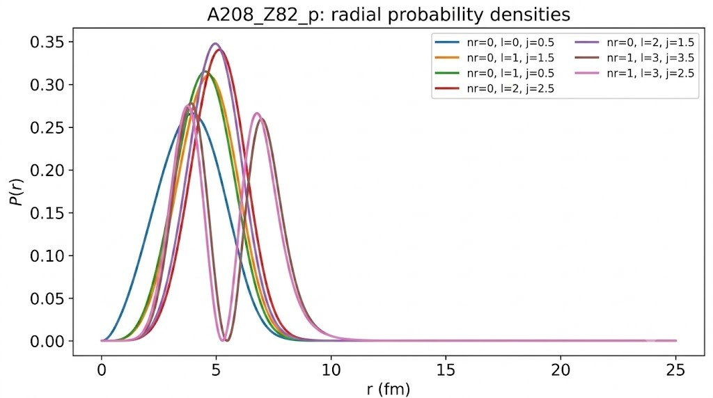
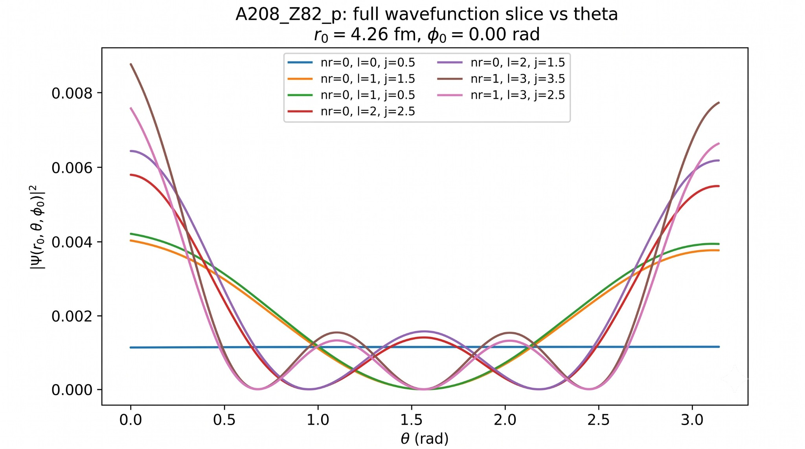
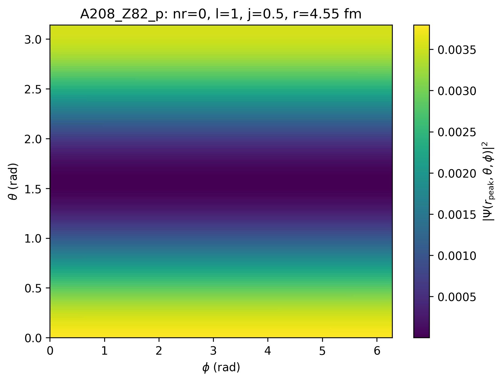

# Probabilistic Physics-Informed Neural Solvers for Woods--Saxon Parameter Identification

Reproducible code for the paper **Probabilistic Physics-Informed Neural
Solvers for Woods--Saxon Parameter Identification: A Coupled Forward--Inverse
Approach**.

1. [Project Description](#1-project-description)
2. [Model / System Architecture](#2-model--system-architecture)
3. [Getting Started & Installation](#3-getting-started--installation)
4. [Usage Examples](#4-usage-examples)
5. [Results & Evaluation](#5-results--evaluation)
6. [Repository Structure](#6-repository-structure)
7. [License](#7-license)

## 1. Project Description

This repository implements a coupled differentiable solver for the forward
solution of the three-dimensional time-independent Schrödinger equation and
the inverse identification of six global Woods--Saxon parameters from sparse
bound single-particle spectra.

The implementation supports the Seminole and Wahlborn potential expressions.
It combines:

- **WaveNet**, which represents separated radial, polar and azimuthal spatial
  wavefunction components.
- **ParamNet**, which infers a dataset-conditioned output distribution over
  the six global interaction parameters.
- An independent radial finite-difference solver for closure validation.
- A deterministic finite-difference least-squares baseline.

All datasets used by the public scripts are included under [`data/`](data/).
The code, configuration files, validation tools and plotting scripts needed to
inspect the workflow are kept in this repository.

## 2. Model / System Architecture

The graphical abstract summarizes the information flow through the coupled
forward--inverse framework. Select the image to open the original vector PDF.

[](docs/figures/graphical_abstract.pdf)

### Inputs and outputs

| Component | Inputs | Outputs |
|---|---|---|
| WaveNet | Spatial coordinate, selected energy vector, nuclear descriptors `(A, Z, species)`, and state quantum numbers `(n_r, l, j)` | Separated components `R(r)`, `Theta(theta)`, and the real/imaginary parts of `Phi(phi)` |
| ParamNet | Normalized radial probes from WaveNet, observed energies, nuclear descriptors, and quantum numbers for every selected system | Global latent mean and scale, transformed into a physical-space distribution over `(V0, kappa, r0, a, lambda_SO, r0_SO)` |
| Independent FD solver | A physical Woods--Saxon parameter set and nuclear/state descriptors | Bound-state energies used for closure and spectral validation |

ParamNet encodes each nucleus/species system and mean-pools the representations,
so the inferred global distribution is invariant to the order of the supplied
systems. The paper normalization is retained: a single coefficient computed
from the full separable wavefunction is applied to the radial component only.

### Joint physics-informed objective

Training couples both networks through:

- Rayleigh-energy consistency.
- Separated radial, polar and azimuthal Schrödinger residuals.
- Boundary, periodicity and phase conditions.
- Explicit wavefunction normalization.
- Selective orthogonality.
- Spin--orbit splitting consistency.
- Kullback--Leibler regularization of the latent output distribution.

## 3. Getting Started & Installation

### Requirements

- Python 3.10 or newer.
- PyTorch, NumPy, SciPy, pandas, Matplotlib and PyYAML.
- A CUDA-capable GPU is recommended for complete training; the scripts also
  run on CPU for short checks.

### Installation

```bash
git clone https://github.com/iraklisspyrou/pinns-tise-3d-woods-saxon-inverse.git
cd pinns-tise-3d-woods-saxon-inverse

python -m venv .venv
```

Activate the environment:

```bash
# Linux/macOS
source .venv/bin/activate

# Windows PowerShell
.\.venv\Scripts\Activate.ps1
```

Install the project:

```bash
python -m pip install --upgrade pip
python -m pip install -e .
```

Optional Weights & Biases support:

```bash
python -m pip install -e ".[tracking]"
```

### Select the experiment

There is one YAML file for each potential expression:

- [`configs/seminole.yaml`](configs/seminole.yaml)
- [`configs/wahlborn.yaml`](configs/wahlborn.yaml)

Each file contains both a synthetic and an experimental experiment. Set:

```yaml
data:
  mode: experimental
```

or retain `mode: synthetic`. The corresponding dataset, selected systems,
state cardinality, epochs and output directory are selected automatically.

The YAML file is the single source of truth for parameter bounds, model
architecture, quadrature and diagnostic grids, loss weights, schedulers,
inference, logging and checkpoint behavior.

## 4. Usage Examples

Run every command from the repository root.

### Train Seminole or Wahlborn

```bash
python scripts/train.py --config configs/seminole.yaml
python scripts/train.py --config configs/wahlborn.yaml
```

To run the **Seminole experimental** identification, first set
`data.mode: experimental` in `configs/seminole.yaml`, then execute the first
command.

Every run copies the exact input YAML and writes a resolved
`run_manifest.json`. Its principal checkpoint files are:

```text
checkpoints/latest_checkpoint.pt
checkpoints/final_checkpoint.pt
checkpoints/best_training_loss.pt
wave_net_global_multinucleus.pt
param_net_global_multinucleus.pt
input_config.yaml
run_manifest.json
```

With `output.resume: true`, rerunning the same command resumes from
`latest_checkpoint.pt`. Use a fresh output directory or set `resume: false`
after changing the potential, parameter bounds, architecture, normalization or
number of selected states. See the [checkpoint guide](checkpoints/README.md).

Verified manuscript `.pt` files are not currently stored in Git. They should
be distributed through a permanent archive or versioned GitHub Release rather
than replaced with fabricated weights.

### Inspect the supplied data

```bash
python scripts/inspect_data.py --output-dir outputs/data_inspection
```

This exports human-readable CSV tables plus dataset-size and energy-coverage
plots. The [dataset guide](data/README.md) documents provenance, schema,
identification subsets and regeneration settings.

### Generate synthetic spectra

```bash
python scripts/generate_data.py --config configs/seminole.yaml \
  --output data/generated_seminole_dataset.npz

python scripts/generate_data.py --config configs/wahlborn.yaml \
  --output data/generated_wahlborn_dataset.npz
```

The systems, maximum quantum numbers, radial box and finite-difference grid are
recorded under `generation:` in each YAML. To generate a spectrum from an
inferred distribution mean:

```bash
python scripts/generate_data.py --config configs/seminole.yaml \
  --parameters outputs/seminole_synthetic/final_global_parameter_prediction.json \
  --output outputs/seminole_pinn_spectrum.npz
```

### Independent finite-difference validation

Validate the reference parameters from the YAML:

```bash
python scripts/fd_validation.py --config configs/seminole.yaml \
  --dataset data/seminole_synthetic_dataset.npz \
  --output outputs/seminole_reference_fd.csv
```

Validate an inferred physical-space distribution mean:

```bash
python scripts/fd_validation.py --config configs/seminole.yaml \
  --parameters outputs/seminole_synthetic/final_global_parameter_prediction.json \
  --dataset data/seminole_synthetic_dataset.npz \
  --output outputs/seminole_inferred_fd.csv
```

### Least-squares baseline

```bash
python scripts/lsq_fit.py \
  --dataset data/experimental_dataset.npz \
  --output-dir outputs/lsq
```

This fits the same 42 identification levels with the independent
finite-difference solver; it is not the original Seminole fit.

### Generate figures

```bash
python visualization/training_visualization.py \
  outputs/seminole_synthetic/training_history.csv

python visualization/results_visualization.py \
  outputs/seminole_synthetic/plots/final/energies/all_nuclei_energy_table.csv

python visualization/spectrum_plots.py \
  --experimental data/experimental_dataset.npz \
  --seminole outputs/seminole_reference_spectrum.npz \
  --pinn outputs/seminole_pinn_spectrum.npz
```

The visualization commands save PDF where applicable. Existing CSV/NPZ output
files can therefore be plotted without retraining.


Reproducibility notes:

- NumPy and PyTorch seeds are set in the YAML files.
- Each run stores the exact YAML and a complete resolved manifest.
- The finite-difference solver is independent of the neural-network code.
- Objective quadrature and plotting grids are configured separately.
- GPU results can differ slightly across CUDA and hardware versions.
- Full paper runs are computationally expensive; reduced grids are suitable
  only for smoke testing.

## 5. Results & Evaluation

### Included datasets

| Dataset | Systems | Levels |
|---|---:|---:|
| Seminole synthetic | 16 | 219 |
| Wahlborn synthetic | 34 | 353 |
| Experimental | 15 | 96 |

The experimental identification subset contains 42 levels: 24 neutron and 18
proton levels from `40Ca`, `48Ca`, `132Sn` and `208Pb`. The complete
experimental archive contains 96 entries, with `90Zr` retained as an
out-of-calibration case.





### Synthetic closure

All six global parameters were recovered with sub-percent relative errors.
After reintroducing the inferred physical-space distribution means into the
independent finite-difference solver, the spectral errors were:

| Parameterization | FD closure MAE [MeV] |
|---|---:|
| Seminole | 0.0109 |
| Wahlborn | 0.0131 |

### Experimental spectra

The physical-space distribution mean is the primary selection-free estimator.

| Potential expression | Reference MAE [MeV] | PINN mean MAE [MeV] |
|---|---:|---:|
| Seminole | 0.7969 | 0.8068 |
| Wahlborn | 1.0783 | 0.8303 |

For the common 94-state Seminole comparison, the finite-difference
least-squares fit gives MAE/RMSE values of 0.8101/1.1807 MeV, while the
benchmark-selected PINN sample gives 0.8056/1.1525 MeV. The selected sample is
reported only as a supplementary benchmark and is not an unbiased estimator.
The work therefore does not claim global superiority over least squares.

ParamNet standard deviations are model-derived output spreads. They are not
presented as calibrated Bayesian credible intervals.

### Representative spectra

The displayed PINN level schemes use the benchmark-selected parameter sample
for illustration; the distribution mean remains the primary estimator.

#### 48Ca



#### 208Pb



### Forward-solution examples

These panels show learned separated spatial wavefunction representations for
proton states in $^{208}$Pb. They are scalar spatial components and should not
be interpreted as complete spinor wavefunctions.

#### Radial probability densities



#### Angular wavefunction slice



#### Angular probability heatmap



## 6. Repository Structure

```text
configs/
  seminole.yaml                 Seminole synthetic/experimental settings
  wahlborn.yaml                 Wahlborn synthetic/experimental settings
data/
  seminole_synthetic_dataset.npz
  wahlborn_synthetic_dataset.npz
  experimental_dataset.npz
  README.md                     provenance, schema and subsets
src/ws_pinn/
  models.py                     WaveNet and ParamNet architectures
  data_loader.py                NPZ loading and state selection
  potentials.py                Seminole and Wahlborn Hamiltonians
  wavefunctions.py              separated wavefunction operations
  losses.py                     physics-informed objective
  training.py                   coupled training and checkpoints
  fd_solver.py                  independent radial FD solver
scripts/
  train.py                      configuration-driven training
  generate_data.py              FD synthetic-spectrum generation
  inspect_data.py               dataset tables and overview plots
  fd_validation.py              independent closure validation
  lsq_fit.py                    least-squares baseline
visualization/
  training_visualization.py     loss and parameter histories
  results_visualization.py      energy and residual figures
  spectrum_plots.py             level-scheme figures
checkpoints/
  README.md                     checkpoint and resume guide
docs/
  data/                         dataset summaries and plots
  figures/                      graphical abstract and paper figures
```

## 7. License

This project is released under the [MIT License](LICENSE).

If you use this repository in scientific work, please cite the accompanying
paper and the permanent archived software release when its DOI becomes
available.
